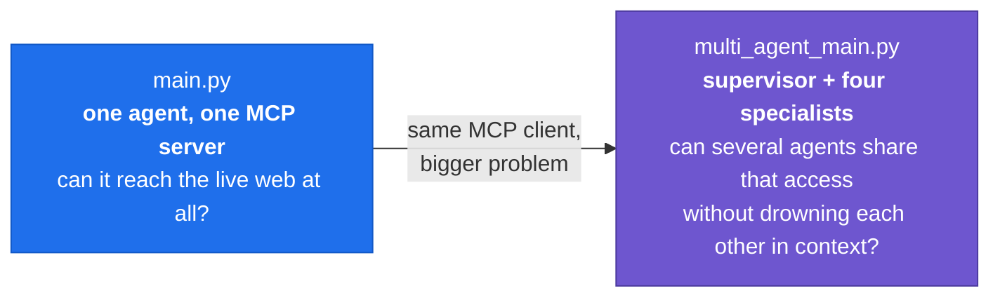
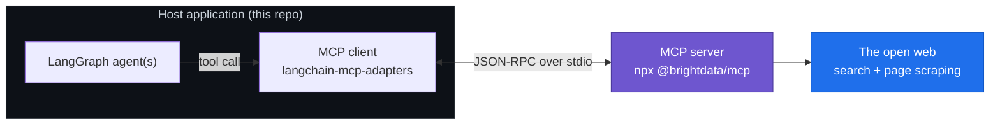
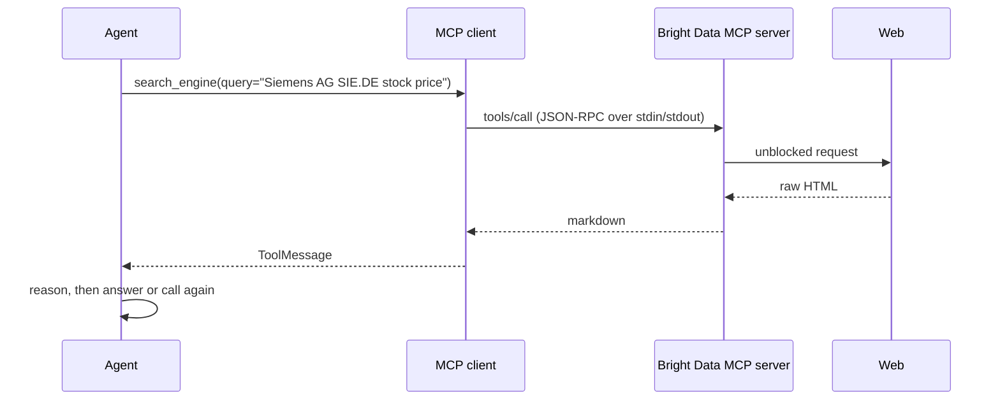
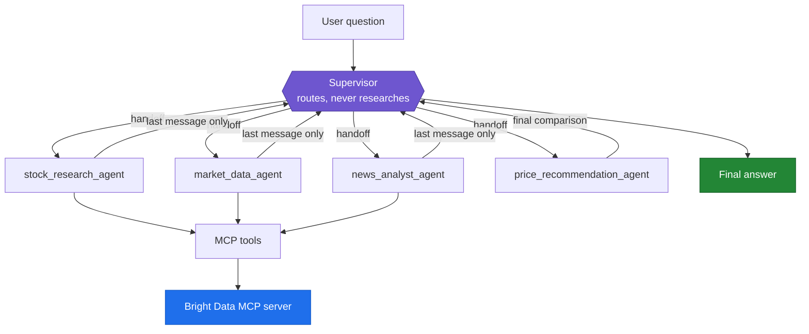
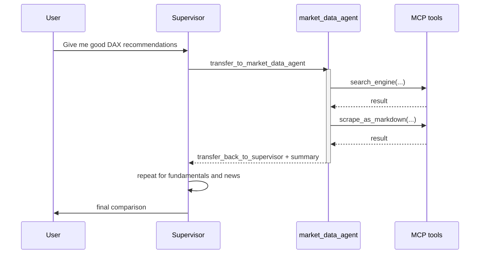
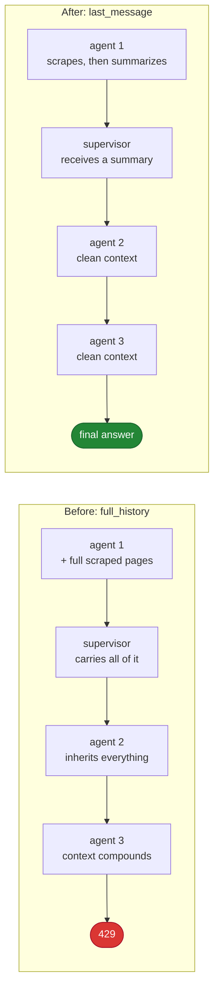

# MCP, Multi Agents and Supervisor
 
Two Python entry points that show the same idea at two levels of ambition: giving a language model real web access through the **Model Context Protocol (MCP)**, first with a single agent, then with a supervisor coordinating four specialists that research DAX-listed companies.
 
<p align="center">
  
  
  
  
  
</p>
 
## Table of contents
 
- [The progression](#the-progression)
- [What MCP is and why it matters here](#what-mcp-is-and-why-it-matters-here)
- [Part one: a single agent](#part-one-a-single-agent)
- [Part two: the supervisor system](#part-two-the-supervisor-system)
- [Context is a budget](#context-is-a-budget)
- [Getting started](#getting-started)
- [Configuration](#configuration)
- [What I learned](#what-i-learned)
- [Troubleshooting](#troubleshooting)
---
 
## The progression
 
The repository is deliberately two files, because the second one only makes sense once the first one works.
 

 
| File | Shape | Question it answers |
| --- | --- | --- |
| `main.py` | One ReAct agent, one MCP server | How does a model get live web data through MCP? |
| `multi_agent_main.py` | Supervisor over four named agents | How do you orchestrate specialists without blowing the context budget? |
 
---
 
## What MCP is and why it matters here
 
The Model Context Protocol is an open standard for connecting language models to tools and data. Rather than writing a bespoke integration per service, the application talks to an **MCP server** over a standard protocol, and the server advertises its capabilities as tools with typed schemas.
 

 
The entire integration is this:
 
```python
client = MultiServerMCPClient(
    {
        "Bright Data": {
            "command": "npx",
            "args": ["@brightdata/mcp"],
            "env": {"API_TOKEN": os.getenv("BRIGHT_DATA_API_TOKEN")},
            "transport": "stdio",   # local server, spawned as a child process
        },
    }
)
tools = await client.get_tools()
```
 
No SDK wrapper, no per-endpoint tool definitions, no argument schemas written by hand. `get_tools()` returns LangChain tools that any agent in the repo can use, and swapping the provider means editing one dictionary.
 
A single call, end to end:
 

 
**Why `stdio` matters.** The server runs locally as a child process and speaks over its stdin and stdout. That makes it fast and keyless from the agent's point of view, and it also means every tool is a coroutine, which forces the whole application to be async.
 
---
 
## Part one: a single agent
 
`main.py` is the smallest thing that proves the connection works: one agent, the Bright Data toolset, one question about live weather in Hannover, and a fixed output format enforced through the system prompt.

```python
agent = create_agent(model, tools, system_prompt="You are a web search agent ...")
response = await agent.ainvoke({"messages": "what is the weather in hannover?"})
print(response["messages"][-1].content)
```


 
```
🌤️ Weather Report
📍 Location: Hannover, Germany
🌡️ Temperature: ...
☁️ Conditions: ...
💨 Wind: ...
🌧️ Forecast: ...
```
 
Two things worth noticing in twenty lines of code. The model answers a question about the present moment, which its training data cannot contain. And the ReAct loop, search then read then answer, is entirely implicit: `create_agent` runs it.
 
---
 
## Part two: the supervisor system
 
`multi_agent_main.py` asks one question and runs a whole research desk:
 
```
Give me good stock recommendations from DAX
```
 
| Agent | Job |
| --- | --- |
| `stock_research_agent` | Revenue, earnings, margins, debt, valuation, recent developments |
| `market_data_agent` | Latest price, daily change, market cap, volume, recent trend |
| `news_analyst_agent` | Recent events, at most three bullets, each judged positive, negative or uncertain |
| `price_recommendation_agent` | Side-by-side comparison and a cautious, evidence-based conclusion |
 

 
Each specialist is its own ReAct agent built with `create_agent`. The supervisor is a graph whose tools are handoffs, which is the part that surprised me most: **transferring control is just a tool call.**
 



 
Because handoffs travel as ordinary messages, the run is fully inspectable. Printing `result["messages"]` shows every transfer, every tool call and every intermediate answer in order.
 
---
 
## Context is a budget
 
The first complete version of the multi-agent script crashed:
 
```
RateLimitError: Request too large for gpt-4o. Limit 30000 TPM, Requested 35389.
```
 
The agent logic was fine. A single scraped page can exceed an entire minute of token budget, and with `output_mode="full_history"` every one of those pages was carried back into the supervisor and forward into the next agent.
 

 
Three changes fixed it:
 
1. **`output_mode="last_message"`** on the supervisor, so an agent returns its conclusion rather than its whole scraping history.
2. **`max_tokens=1000`** on the model, which caps what any single step can emit.
3. **Output discipline in every system prompt**: never return long scraped content, keep responses concise, cap the news agent at three bullets.
If you run on a low tokens-per-minute tier and still hit the ceiling, the next levers are an allowlist so only `search_engine` and `scrape_as_markdown` are exposed, a character cap applied to tool results before they reach the model, and a rate limiter that spaces requests out.
 
---
 
## Getting started
 
**Requirements:** Python 3.10 or newer, Node.js (the MCP server runs through `npx`), an OpenAI API key, a Bright Data API token.
 
```bash
python3 -m venv .venv
source .venv/bin/activate          # Windows: .venv\Scripts\Activate.ps1
pip install -r requirements.txt
```
 
`requirements.txt`:
 
```
python-dotenv
langchain
langgraph
langchain-mcp-adapters
langchain-openai
langgraph-supervisor
```
 
`.env`:
 
```env
OPENAI_API_KEY=sk-...
BRIGHT_DATA_API_TOKEN=...
```
 
Run either entry point:
 
```bash
python main.py                # single agent, live weather
python multi_agent_main.py    # supervisor, DAX research
```
 
The first run downloads the MCP server through `npx`, so give it a moment.
 
---
 
## Configuration
 
| Setting | Where | Effect |
| --- | --- | --- |
| `transport: "stdio"` | MCP client config | Runs the server locally as a child process |
| `max_tokens=1000` | `init_chat_model` | Caps what any single step emits |
| `output_mode="last_message"` | `create_supervisor` | Agents return conclusions, not full histories |
| `add_handoff_back_messages=True` | `create_supervisor` | Makes transfers visible in the message stream |
| System prompts | Each `create_agent` call | Where output discipline and grounding rules live |
 
---
 
## What I learned
 
**1. MCP turns integrations into configuration.** Adding a data source became a dictionary entry rather than a client library, an auth flow and a stack of hand-written tool schemas.
 
**2. Transport is an architectural choice.** `stdio` spawns the server locally, which is ideal for a desktop or CLI tool, and it is the reason every tool here is async.
 
**3. Async is not optional.** Calling the synchronous `.stream()` raised `StructuredTool does not support sync invocation`, because tools loaded with `await client.get_tools()` are coroutines. The whole graph has to run under `ainvoke` or `astream`.
 
**4. Start with one agent.** `main.py` isolated the MCP wiring so that when the multi-agent version broke, I already knew the connection was not the problem.
 
**5. Context is a budget, not an afterthought.** The 429 was an architecture problem wearing a rate-limit costume. What each agent hands back matters more than what it does internally.
 
**6. Handoffs are tool calls.** Once that clicked, the supervisor stopped being magic. It is a normal agent whose tools happen to be other agents, which is also why the whole run is readable from the message list.
 
**7. Frameworks move.** `langgraph.prebuilt.create_react_agent` is deprecated in LangGraph v1 in favour of `langchain.agents.create_agent`, where `prompt` is renamed to `system_prompt`. Migrating beat suppressing the warning.
 
**8. Agents will confidently fetch the wrong company.** An early run compared Siemens Ltd India instead of Siemens AG, because nothing in the query pinned down the listing. Grounding with Xetra tickers such as `SIE.DE` fixed what no amount of prompt polish would have.
 
---
 
## Troubleshooting
 
| Symptom | Cause | Fix |
| --- | --- | --- |
| `Request too large ... TPM` | Too much context per call | Keep `output_mode="last_message"`, tighten the prompts, cap tool output |
| `StructuredTool does not support sync invocation` | Sync call path over async MCP tools | Use `ainvoke` or `astream` with `async for` |
| `LangGraphDeprecatedSinceV10` | Old prebuilt import | `from langchain.agents import create_agent`, `prompt` becomes `system_prompt` |
| `externally-managed-environment` on install | Virtualenv not activated | `source .venv/bin/activate` before installing |
| `command not found: npx` | Node.js missing | Install Node, the MCP server runs through it |
| Wrong company's financials | Ambiguous search terms | Name the ticker in the prompt |
