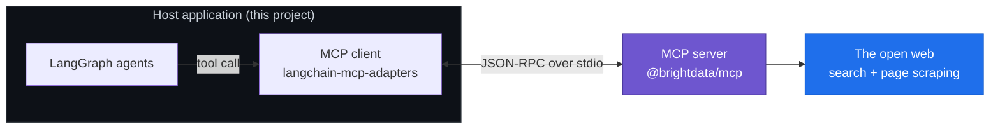
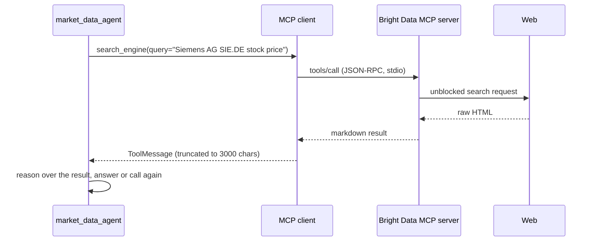
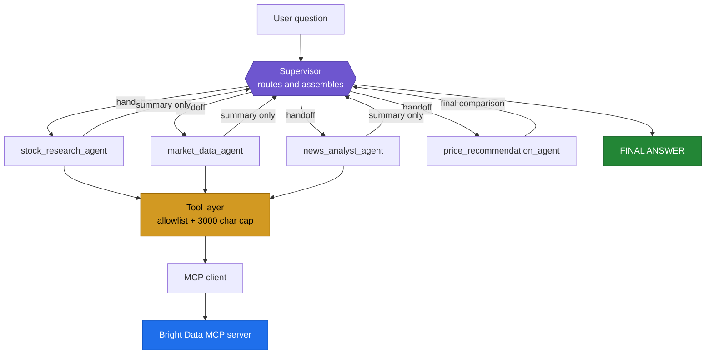
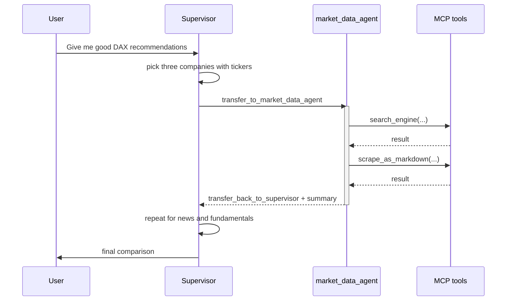
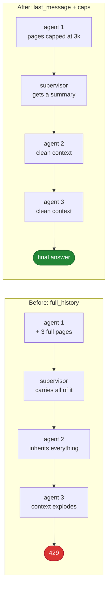

Readme · MD

# DAX Multi-Agent Research

A supervisor-led multi-agent system that researches German blue chip stocks using live web data pulled through the **Model Context Protocol (MCP)**.

Four specialized agents split the work: fundamentals, market data, news, and a final comparison. A supervisor decides who runs next and hands the task over. All web access happens through a Bright Data MCP server, not through hardcoded APIs.

<p align="center">
  
  
  
  
</p>
---
 
## Table of contents
 
- [What it does](#what-it-does)
- [What MCP is and why it matters here](#what-mcp-is-and-why-it-matters-here)
- [Architecture](#architecture)
- [The supervisor pattern](#the-supervisor-pattern)
- [Context engineering, the hard part](#context-engineering-the-hard-part)
- [Sample run](#sample-run)
- [Getting started](#getting-started)
- [Configuration](#configuration)
- [What I learned](#what-i-learned)
- [Troubleshooting](#troubleshooting)
- [Disclaimer](#disclaimer)
---
 
## What it does
 
You ask one question:
 
```
Give me good stock recommendations from DAX
```
 
The system then runs a full research pipeline on its own:
 
| Agent | Job |
| --- | --- |
| `stock_research_agent` | Revenue, earnings, margins, debt, valuation, recent developments |
| `market_data_agent` | Latest price, daily change, market cap, volume, recent trend |
| `news_analyst_agent` | Recent announcements and events, each classified as positive, negative or uncertain |
| `price_recommendation_agent` | Side by side comparison and a cautious, evidence-based conclusion |
 
The supervisor never researches anything itself. It picks the companies, routes the work, and assembles the final answer.
 
---
 
## What MCP is and why it matters here
 
The Model Context Protocol is an open standard for connecting language models to tools and data. Instead of writing a custom integration for every service, a model talks to an **MCP server** over a standard protocol, and the server exposes its capabilities as tools with typed schemas.
 
The three roles:
 

 
What this buys the project:
 
- **No API glue code.** The server is launched with `npx @brightdata/mcp` and its tools appear automatically as LangChain tools.
- **Swappable capability.** Swapping the data provider means swapping one entry in the client config, not rewriting the agents.
- **Typed contracts.** Every tool arrives with a JSON schema, so the model knows exactly what arguments it can pass.
A single tool call end to end:
 

 
The transport here is **stdio**: the server runs as a local child process and messages travel over its stdin and stdout. That detail matters in practice, and it produced one of the bugs described further down.
 
---
 
## Architecture
 

 
Each agent is its own ReAct loop built with `create_agent`. The supervisor is a LangGraph graph whose "tools" are handoffs to those agents.
 
---
 
## The supervisor pattern
 
Handoffs are just tool calls. That is the whole trick.
 

 
Because handoffs are tool calls, they show up in the message stream, which is what makes the live transcript possible:
 
```
[supervisor]
  handing off to market_data_agent
 
[market_data_agent]
  calling search_engine(query=Siemens AG SIE.DE stock price, engine=google)
  got 3037 chars back
  Siemens AG traded at ... as of 4 September 2026.
  handing back to supervisor
```
 
---
 
## Context engineering, the hard part
 
The first working version crashed:
 
```
RateLimitError: Request too large for gpt-4o. Limit 30000 TPM, Requested 35389.
```
 
Nothing was wrong with the agent logic. The problem was that a single scraped page can be larger than an entire minute of token budget, and `output_mode="full_history"` carried every one of those pages through the whole graph.
 

 
Four changes, in order of impact:
 
1. **`output_mode="last_message"`** so each agent returns only its conclusion instead of its entire scraping history.
2. **A truncation wrapper around every MCP tool**, capping results at 3000 characters before they ever reach the model.
3. **A tool allowlist.** Bright Data exposes around fifty tools, and all of their schemas were being sent on every single call. Only `search_engine` and `scrape_as_markdown` are needed.
4. **A rate limiter** that spaces requests out, so a burst of parallel tool calls does not blow the per-minute budget.
The lesson generalizes past this project: in a multi-agent system, what an agent returns to its caller matters more than what it does internally.
 
---
 
## Sample run
 
```
==========================================================================================
DAX MULTI-AGENT RESEARCH: Give me good stock recommendations from DAX
==========================================================================================
 
[supervisor]
  handing off to stock_research_agent
 
[stock_research_agent]
  calling search_engine(query=Siemens AG SIE.DE revenue earnings 2026)
  got 3021 chars back
  Siemens AG reported ... Reported figures are as of the Q3 statement.
  handing back to supervisor
 
[supervisor]
  handing off to news_analyst_agent
 
...
 
==========================================================================================
FINAL ANSWER
==========================================================================================
  Siemens AG (SIE.DE)
  Strengths: ...
  Risks: ...
```
 
---
 
## Getting started
 
**Requirements:** Python 3.10 or newer, Node.js (the MCP server runs through `npx`), an OpenAI API key, a Bright Data API token.
 
```bash
git clone <your-repo-url>
cd MCP_Project
 
python3 -m venv .venv
source .venv/bin/activate          # Windows: .venv\Scripts\Activate.ps1
 
pip install -r requirements.txt
```
 
`requirements.txt`:
 
```
python-dotenv
langchain
langgraph
langchain-mcp-adapters
langchain-openai
langgraph-supervisor
```
 
Create a `.env` file:
 
```env
OPENAI_API_KEY=sk-...
BRIGHT_DATA_API_TOKEN=...
```
 
Run it:
 
```bash
python multi_agent_main.py
```
 
---
 
## Configuration
 
Everything worth tuning sits at the top of the file.
 
| Setting | Default | What it controls |
| --- | --- | --- |
| `ALLOWED_TOOLS` | `search_engine`, `scrape_as_markdown` | Which MCP tools the agents can see |
| `MAX_TOOL_CHARS` | `3000` | Hard cap on any single tool result |
| `requests_per_second` | `0.33` | Spacing between model calls |
| `output_mode` | `last_message` | How much of an agent's history returns to the supervisor |
| `SHOW_SERVER_LOGS` | unset | Set to `1` to see the raw MCP server output |
 
If you are on a low tokens-per-minute tier and still hit limits, lower `MAX_TOOL_CHARS` to 1500 first.
 
---
 
## What I learned
 
**1. MCP turns integrations into configuration.** Adding a data source became a dictionary entry rather than a client library, an auth flow and a wrapper class.
 
**2. Async is not optional with stdio MCP tools.** Calling `supervisor.stream()` raised `StructuredTool does not support sync invocation`, because MCP tools loaded with `await client.get_tools()` are coroutines. The whole graph has to run under `astream`.
 
**3. Context is a budget, not an afterthought.** The 429 was an architecture problem wearing a rate-limit costume. Fixing it meant deciding what each agent is allowed to pass on, not buying more quota.
 
**4. Tool schemas cost tokens too.** Fifty unused tool definitions on every call is real money and real latency.
 
**5. Streams are duplicated by design.** With `astream(subgraphs=True)`, each message arrives once from the sub-agent graph and once from the parent, which is why the raw log looked like everything was printed twice. Deduplicating by message id fixed it.
 
**6. Frameworks move.** `langgraph.prebuilt.create_react_agent` is deprecated in LangGraph v1 in favour of `langchain.agents.create_agent`, where `prompt` is renamed to `system_prompt`. Migrating beat suppressing the warning.
 
**7. Agents will confidently fetch the wrong company.** An early run compared Siemens Ltd India instead of Siemens AG, because the search never pinned down the listing. Passing Xetra tickers such as `SIE.DE` through every handoff fixed it. Grounding matters more than prompt polish.
 
**8. Observability is a feature.** A wall of raw message dumps hides what the system is doing. A transcript that shows handoffs, tool calls and result sizes turns the same run into something you can actually debug and explain.
 
---
 
## Troubleshooting
 
| Symptom | Cause | Fix |
| --- | --- | --- |
| `Request too large ... TPM` | Too much context per call | Lower `MAX_TOOL_CHARS`, keep `output_mode="last_message"` |
| `StructuredTool does not support sync invocation` | Sync `.stream()` on async MCP tools | Use `astream` with `async for` |
| `LangGraphDeprecatedSinceV10` | Old prebuilt import | Use `from langchain.agents import create_agent` |
| `externally-managed-environment` on install | Virtualenv not activated | `source .venv/bin/activate` first |
| Zone checks and 502 dumps in the output | MCP server logging to inherited stderr | Left redirected by default, set `SHOW_SERVER_LOGS=1` to inspect |
| Wrong company's financials | Ambiguous search terms | Keep tickers in the supervisor prompt |
 
---
 
## Disclaimer
 
This project is a demonstration of multi-agent orchestration and MCP tooling. Its output is automated research, not financial advice, and the figures it reports come from public web sources that may be incomplete or out of date. Do not make investment decisions based on it.
